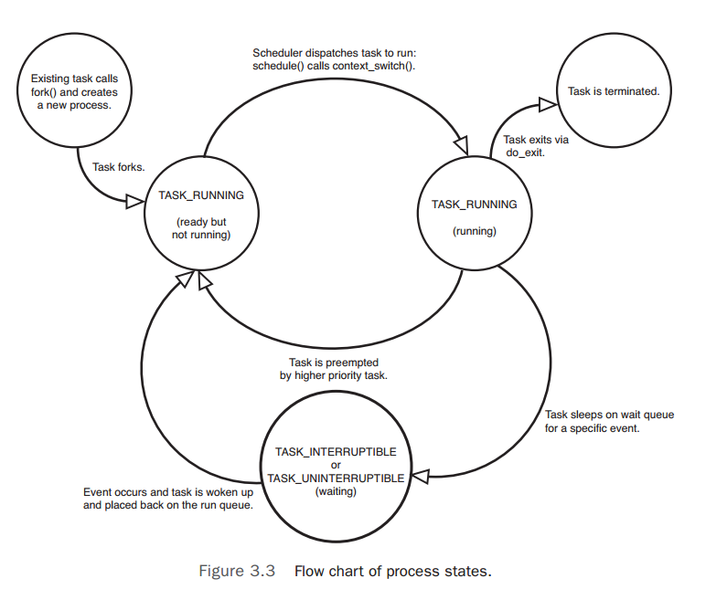

#Process Management
##Process Descriptor and the Task Structure
The kernel stores the list of processes in a circular doubly linked list called the task list. Each element in the task list is a process descriptor of the type struct task_struct, which is defined in `<linux/sched.h>`. The process descriptor contains all the information about a specific process.

The task_struct is a relatively large data structure, at around 1.7 kilobytes on a 32-bit machine. The process descriptor contains the data that describes the executing program--open files, the process's address space, pending signals, the process's state, and much more.


###Allocating the Process Descriptor
The task_struct structure is allocated via the slab allocator to provide object reuse and cache coloring. Prior to the 2.6 kernel series, struct task_struct was stored at the end of the kernel stack of each process. This allows architectures with few registers, such as x86, to calculate the location of the process descriptor via the stack pointer without using an extra register to store the location. With the process descriptor now dynamically created via the slab allocator, a new structure, struct thread_info, was created that again lives at the bottom of the stack(for stacks that grow down) and at the top of the stack(for stacks that grow up).

The thread_info structure is defined on x86 in `<asm/thread_info.h>` as

```C
struct thread_info {
	struct task_struct	*task;
	struct exec_domain	*exec_domain;
	__u32				flags;
	__u32				status;
	__u32				cpu;
	int					preempt_count;
	mm_segment_t		addr_limit;
	struct restart_block restart_block;
	void				*sysenter_return;
	int					uaccess_err;
};
```


Each task's thread_info structure is allocated at the end of its stack. The stack element of the structure is a pointer to the stack's actual task_struct.

###Storing the Process Descriptor
The system identifies processes by a unique process identification value or PID. The PID is a numerical value represented by the opaque type pid_t, which is typically an int. The kernel stores this value as pid inside each process descriptor.

Inside the kernel, tasks are typically referenced directly by a pointer to their task_struct structure. In fact, most kernel code that deals with processes works directly with struct task_struct. Consequently, it is useful to be able to quickly look up the process descriptor of the currently executing task, which is done via the current macro. This macro must be independently implemented by each architecture.

Some architectures save a pointer to the task_struct structure of the currently running process in a register, enabling for efficient access. Other architectures, such as x86(which has few registers to waste), make use of the fact that struct thread_info is stored on the kernel stack to calculate the location of thread_info and subsequently the task_struct.

On x86, current is calculated by masking out the 13 least-significant bits of the stack pointer to obtain the thread_info structure. This is done by the `current_thread_info()` function. The assembly is shown here:

```asm
movl $-8192, %eax
andl %esp, %eax
```

This assumes that the stack size is 8KB. When 4KB are enabled, 4096 is used in lieu of 8192.

Finally, current dereferences the task member of thread_info to return the task_struct:

```C
current_thread_info()->task;
```

###Process State
The state field of the process descriptor describes the current condition of the process. Each process on the system is in exactly one of five different states.

- TASK_RUNNING--The process is runnable; it is either currently running or on a run-queue waiting to run. This is the only possible state for a process executing in user-space; it can also apply to a process in kernel-space that is actively running.
- TASK_INTERRUPTIBLE--The process is sleeping(that is, it is blocked), waiting for some condition to exist. When this condition exists, the kernel sets the process's state to TASK_RUNNING. The process also awakes prematurely and becomes runnable if it receives a signal.
- TASK_UNINTERRUPTIBLE--This state is identical to TASK_INTERRUPTIBLE except that it does not wake up and become runnable if it receives a signal. This is used in situations where the process must wait without interruption or when the event is expected to occur quite quickly. Because the task does not respond to signals in this state, TASK_UNINTERRUPTIBLE is less often used than TASK_INTERRUPTIBLE.
- __TASK_TRACED--The process is being traced by another process, such as a debugger, via ptrace.
- __TASK_STOPPED--Process execution has stopped; the task is not running nor is it eligible to run. This occurs if the task receives the SIGSTOP,SIGTSTP,SIGTTIN,or SIGTTOU signal or if it receives any signal while it is being debugged.



###Manipulating the Current Process State
Kernel code often needs to change a process's state. The preferred mechanism is using
 
```C
set_task_state(task, state); /* set task 'task' to state 'state' */
```

This function sets the given task to the given state. If applicable, it also provides a memory barrier to force ordering on other processors.(This is only needed on SMP systems.) Otherwise, it is equivalent to

```C
task->state = state;
```

The method `set_current_state(state)` is synonymous to `set_task_state(current, state)`.

###Process Context
One of the most important parts of a process is the executing program code. This code is read in from an executable file and executed within the program's address space. Normal program execution occurs in user-space. When a program executes a system call or triggers an execption

###The Process Family Tree

##Process Creation
##The Linux Implementation of Threads
##Process Termination