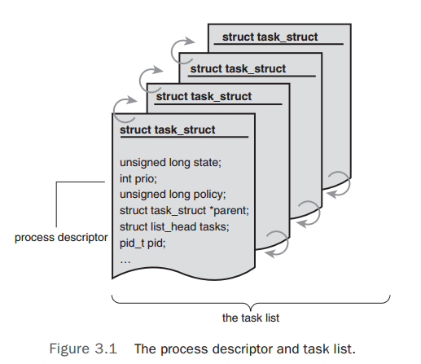
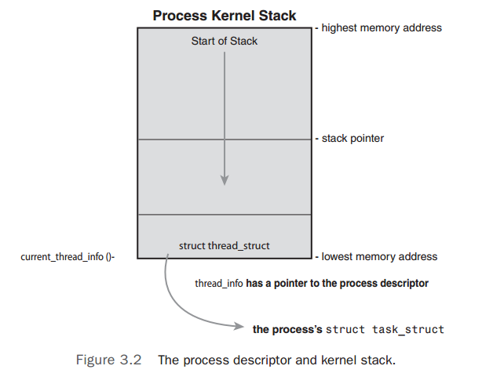

#Process Management
##Process Descriptor and the Task Structure
The kernel stores the list of processes in a circular doubly linked list called the task list. Each element in the task list is a process descriptor of the type struct task_struct, which is defined in `<linux/sched.h>`. The process descriptor contains all the information about a specific process.

The task_struct is a relatively large data structure, at around 1.7 kilobytes on a 32-bit machine. The process descriptor contains the data that describes the executing program--open files, the process's address space, pending signals, the process's state, and much more.



###Allocating the Process Descriptor
The task_struct structure is allocated via the slab allocator to provide object reuse and cache coloring. Prior to the 2.6 kernel series, struct task_struct was stored at the end of the kernel stack of each process. This allows architectures with few registers, such as x86, to calculate the location of the process descriptor via the stack pointer without using an extra register to store the location. With the process descriptor now dynamically created via the slab allocator, a new structure, struct thread_info, was created that again lives at the bottom of the stack(for stacks that grow down) and at the top of the stack(for stacks that grow up).

The thread_info structure is defined on x86 in `<asm/thread_info.h>` as

```C
struct thread_info {
	struct task_struct	*task;
	struct exec_domain	*exec_domain;
	__u32				flags;
	__u32				status;
	__u32				cpu;
	int					preempt_count;
	mm_segment_t		addr_limit;
	struct restart_block restart_block;
	void				*sysenter_return;
	int					uaccess_err;
};
```



Each task's thread_info structure is allocated at the end of its stack. The stack element of the structure is a pointer to the stack's actual task_struct.

###Storing the Process Descriptor
###Process State
###Manipulating the Current Process State
###Process Context
###The Process Family Tree

##Process Creation
##The Linux Implementation of Threads
##Process Termination